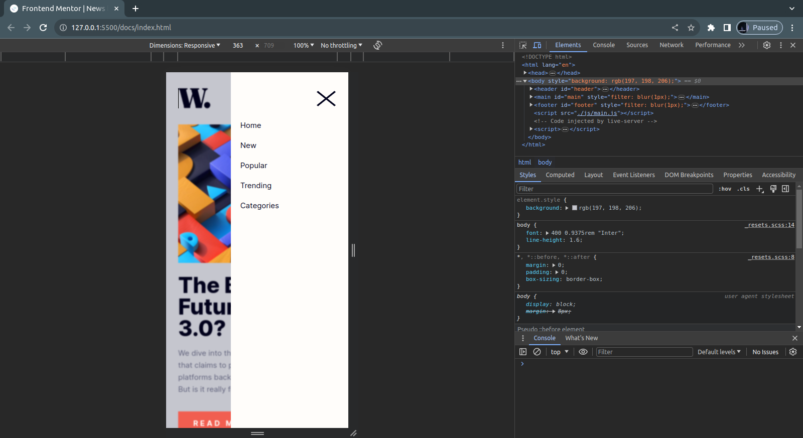

# Frontend Mentor - News homepage solution

This is a solution to the [News homepage challenge on Frontend Mentor](https://www.frontendmentor.io/challenges/news-homepage-H6SWTa1MFl). Frontend Mentor challenges help you improve your coding skills by building realistic projects. 

## Table of contents

- [Overview](#overview)
  - [The challenge](#the-challenge)
  - [Screenshot](#screenshot)
  - [Links](#links)
- [My process](#my-process)
  - [Built with](#built-with)
  - [What I learned](#what-i-learned)
  - [Continued development](#continued-development)
  - [Useful resources](#useful-resources)
- [Author](#author)

**Note: Delete this note and update the table of contents based on what sections you keep.**

## Overview

### The challenge

Users should be able to:

- View the optimal layout for the interface depending on their device's screen size
- See hover and focus states for all interactive elements on the page
- **Bonus**: Toggle the mobile menu (requires some JavaScript)

### Screenshot




### Links

- Solution URL: [Frontend Mentor Solution](https://www.frontendmentor.io/solutions/news-homepage-main-ML4X6ozH5V)
- Live Site URL: [See live page](https://tzienom.github.io/News-Homepage/)

## My process

### Built with

- Semantic HTML5 markup
- SASS custom properties
- Flexbox
- CSS Grid
- SASS (SCSS syntax)
- Mobile-first workflow


### What I learned

At the course of undergoing this challenge, I learnt how to toggle a mobile navigation bar (my very first ever):

```scss
#nav_list {
        position: fixed;
        top: 0;
        right: -20px;
        background: color('Off_white');
        width: 0;
        height: 100%;
        padding: 6.25em 0 0 1.25em;
        z-index: 1;
}
```

The above css basically creates the nav bar and hides it with a width of 0px. This JS was used to toggle the
the width of the nav bar to get it to overlay on the page:

```js
MENU_OPEN.addEventListener('click', () => {
    NAVLIST.style.width = '70%'; /* Navbar takes 70% of the mobile screen size */
    NAVLIST.style.transition = '.5s';

    MENU_OPEN.style.display = 'none'; /* Hide the #menu_open icon when navbar is open */
    MENU_CLOSE.style.display = 'block'; /* Display the #menu_close icon when the navbar is open */

    document.querySelector('body').style.background = 'hsl(233, 8%, 79%)'; /* Changes the background color of the body when navbar is open */

    // The following blurs every selected element on the body when navbar is open - exempting navbar */
    document.querySelector('#logo').style.filter = 'blur(1px)';
    document.querySelector('#main').style.filter = 'blur(1px)';
    document.querySelector('#footer').style.filter = 'blur(1px)';
});
```

While I was at this challenge, I learnt to create a simple ripple effect for buttons:

```scss
&:after {
            position: absolute;
            content: "";
            background: color("Soft_orange");
            color: color("Very_dark_blue");
            transform: scale(0);
            transition: all .8s ease;
            opacity: 0;
        }

        &:active:after {
            padding: 0;
            margin: 0;
            opacity: 1;
            transform: scale(2);
            transition: 0s;
        }
```
### Continued development

- SASS
- CSS Grid
- Mobile (Side) Navigation


### Useful resources

- [How to Create Ripple Effect](https://www.w3schools.com/howto/tryit.asp?filename=tryhow_css_buttons_animate2) - This helped me learn how to create a ripple effect for a button. I really liked this pattern and will use it going forward.

- [Creating a Sidenav Overlay](https://www.w3schools.com/howto/howto_js_sidenav.asp) - This is a W3 How-to resource that helped me learn how to create a sidenav overlay.

## Author

- Frontend Mentor - [Tzienom](https://www.frontendmentor.io/profile/yourusername)
- Twitter - [Tzienom](https://www.twitter.com/Tzienom)